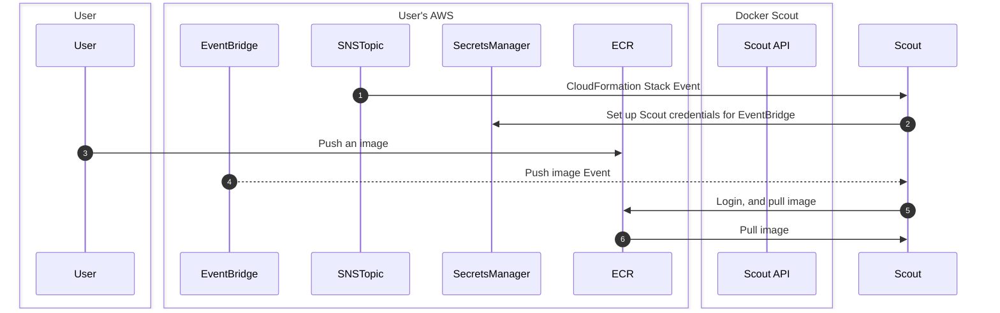



Integrating Docker Scout with Amazon Elastic Container Registry (ECR) lets you
view image insights for images hosted in ECR repositories. After integrating
Docker Scout with ECR and activating Docker Scout for a repository, pushing an
image to the repository automatically triggers image analysis. You can view
image insights using the Docker Scout Dashboard, or the `docker scout` CLI
commands.

## How it works

To help you integrate Docker Scout with ECR, you can use a CloudFormation stack
template that creates and configures the necessary AWS resources for
integrating Docker Scout with your ECR registry. For more details about the AWS
resources, see [CloudFormation stack template](#cloudformation-stack-template)

The following diagram shows how the Docker Scout ECR integration works.

After the integration, Docker Scout automatically pulls and analyzes images
that you push to the ECR registry. Metadata about your images are stored on the
Docker Scout platform, but Docker Scout doesn't store the container images
themselves. For more information about how Docker Scout handles image data, see
[Data handling](../../data-handling.md).

### CloudFormation stack template

The following table describes the configuration resources.

> **Note**
>
> Creating these resources incurs a small, recurring cost on the AWS account.
> The **Cost** column in the table represents an estimated monthly cost of the
> resources, when integrating an ECR registry that gets 100 images pushed per day.

| Resource type                 | Resource name          | Description                                                                                  | Cost  |
| ----------------------------- | ---------------------- | -------------------------------------------------------------------------------------------- | ----- |
| `AWS::SNSTopic::Topic`        | `SNSTopic`             | SNS topic for notifying Docker Scout when the AWS resources have been created.               | Free  |
| `AWS::SNS::TopicPolicy`       | `TopicPolicy`          | Defines the topic for the initial setup notification.                                        | Free  |
| `AWS::SecretsManager::Secret` | `ScoutAPICredentials`  | Stores the credentials used by EventBridge to fire events to Scout.                          | $0.42 |
| `AWS::IAM::Role`              | `AssumeRoleScoutSetup` | This role is used during initial setup, and has write access to `ScoutAPICredentials`.       | Free  |
| `AWS::Events::ApiDestination` | `ApiDestination`       | Sets up the EventBridge connection to Docker Scout for sending ECR push and delete events.   | $0.01 |
| `AWS::Events::Connection`     | `Connection`           | EventBridge connection credentials to Scout.                                                 | Free  |
| `AWS::Events::Rule`           | `Rule`                 | Defines the rule to send ECR pushes and deletes to Scout.                                    | Free  |
| `AWS::IAM::Role`              | `InvokeApiRole`        | Internal role to grant the event access to `ApiDestination`.                                 | Free  |
| `AWS::IAM::Role`              | `AssumeRoleEcrAccess`  | Grants the following ECR privileges to Docker Scout: login access, pull images, list images. | Free  |

## Integrate your first registry

Create the CloudFormation stack in your AWS account to enable the Docker Scout
integration. You must have access to an AWS account with permission to create
resources.

To create the stack:

1. Go to [ECR integrations](https://scout.docker.com/settings/integrations/ecr)
   on the Docker Scout Dashboard.
2. Make sure the correct Docker organization is selected in the Dashboard
   header.

   If not, switch organizations using the drop-down menu.

3. Select the **Create on AWS** button.

   This opens the **Create stack** wizard in the AWS CloudFormation console in
   a new browser tab. If you're not already signed in to AWS, you're redirected
   to the sign-in page.

4. Follow the steps in the **Create stack** wizard until the end, and complete
   the procedure by creating the resources.

   The fields in the wizard are pre-populated by the CloudFormation template,
   so you don't need to edit any of the fields.

5. When you've created the resources, head back to the [ECR
   integrations](https://scout.docker.com/settings/integrations/ecr) on the
   Docker Scout Dashboard.

   You should see a list of Amazon ECR integrations.

   > **Note**
   >
   > If the status shows **In progress**, it means that the integration was not
   > yet completed on the AWS side. Select the **In progress** link to open the
   > CloudFormation wizard, and complete all the steps.
   >
   > If you did complete all the steps, try manually refreshing the page.

The ECR integration is now active. For Docker Scout to start analyzing images
in the registry, you need to activate it for each repository. Refer to
[repository settings](../../dashboard.md#repository-settings).

After activating repositories, images that you push will be analyzed by Docker
Scout, and the analysis results will appear in the Docker Scout Dashboard.

## Integrate additional registries

To add additional registries:

1. Go to [ECR integrations](https://scout.docker.com/settings/integrations/ecr)
   on the Docker Scout Dashboard.
2. Make sure the correct Docker organization is selected in the Dashboard
   header.

   If not, switch organizations using the drop-down menu.

3. Select the **Add** button at the top of the list.
4. Select **Create on AWS**.

   The **Create stack** wizard in the AWS CloudFormation console opens.

5. Complete the steps and return to the
   [ECR integrations](https://scout.docker.com/settings/integrations/ecr)
   when you're done.
6. The new integrations appear in the list once completed.

Next, activate Docker Scout for the repositories that you want to analyze in
[repository settings](../../dashboard.md#repository-settings).
